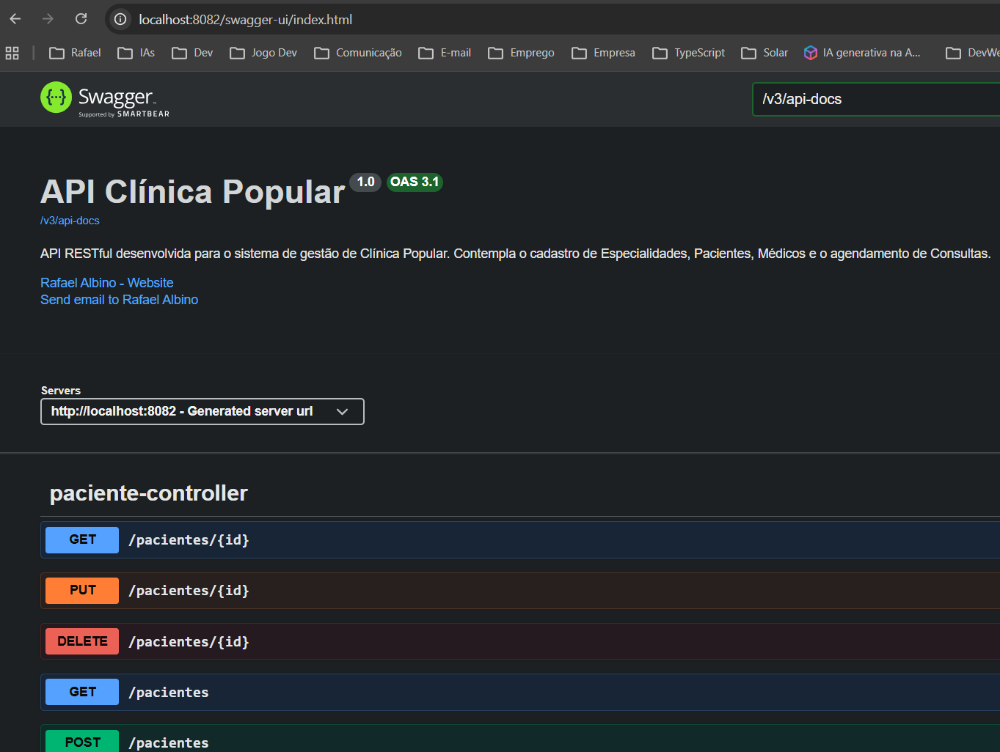

# API RESTful - Clínica Popular

## 👨‍💻 Desenvolvedor
* **Nome:** Rafael Albino Ribeiro
* **GitHub:** [Albino57](https://github.com/Albino57)

## 📄 Descrição do Projeto
O objetivo é simular o sistema de gerenciamento de uma **Clínica Popular**, permitindo o controle de operações fundamentais através do mapeamento das seguintes entidades principais: Paciente, Prontuario, Medico, Consulta e Especialidade e outros.

## 🚀 Instruções de Execução
### Pré-requisitos
* Java 17 (ou superior)
* Maven
* PostgreSQL instalado e rodando localmente na porta padrão (5432)
* Postman

### Configuração do Banco de Dados
No arquivo *src/main/resources/application.properties*, configure as credenciais do seu banco de dados PostgreSQL. Crie um banco vazio chamado *API_Clinica_Popular* e ajuste as propriedades abaixo:

**application.properties:**
spring.datasource.url=jdbc:postgresql://localhost:5432/API_Clinica_Popular
spring.datasource.username=postgres
spring.datasource.password=SUA_SENHA_AQUI

### O projeto está configurado para rodar na porta 8082 para evitar conflitos
server.port=8082

Como Rodar a Aplicação
### Clone este repositório para a sua máquina.
### Importe o projeto na sua IDE de preferência (Eclipse, IntelliJ, etc.) como um projeto Maven. **(Recomando usar o Eclipse)**
### Aguarde o download das dependências (ou force um Maven -> Update Project).
### Execute a classe principal ApiClinicaPopularApplication.java.

### **Para usar os Endpoints, é muito recomendado usar o SWAGGER.**
http://localhost:8082/swagger-ui/index.html

## 🛠️ Tecnologias Utilizadas
O projeto foi construído utilizando o seguinte ecossistema tecnológico:
* **Java**
* **Spring Boot**
* **Spring Data JPA & Hibernate**
* **PostgreSQL**
* **Maven**
* **Bean Validation**
* **Swagger / OpenAPI**

## 📌 Exemplos de Endpoints
1. Cadastrar Especialidade
Método: POST
URL: http://localhost:8082/especialidades
Body (JSON):
{
    "nome": "",
    "descricao": ""
}

2. Cadastrar Médico
Método: POST
URL: http://localhost:8082/medicos
Body (JSON):
{
    "nome": "Dr. Carlos Eduardo",
    "cpf": "12345678901",
    "telefone": "+5524981058105",
    "email": "cadu.medico@clinica.com",
    "crm": "CRM/RJ 123456",
    "especialidadeId": 1
}

3. Get do Médico
Método: GET
URL: http://localhost:8082/medicos

## 📚 Documentação (Swagger)
http://localhost:8082/swagger-ui/index.html

A documentação completa e testável da API foi gerada pelo Swagger. Com a aplicação rodando, acesse a URL abaixo no seu navegador:
